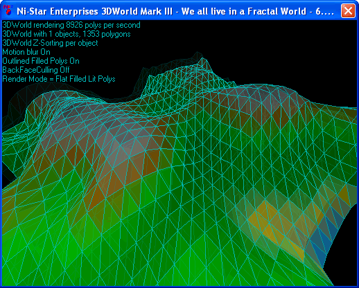



## n 3D World Mark III: We All Live in a Fractal World

### Description

This code is an example of a 3D Terrain generator and 3D graphics displaying engine. I uploaded it as it's an excellent example of how easy it is to code 3D and i haven't uploaded any code for ages.
 
### More Info
 

             |
---                |---
**Submitted On**   |2002-05-09 17:19:00
**By**             |[Niall Mooney](https://github.com/Planet-Source-Code/PSCIndex/blob/master/ByAuthor/niall-mooney.md)
**Level**          |Advanced
**User Rating**    |5.0 (15 globes from 3 users)
**Compatibility**  |VB 6\.0
**Category**       |[Graphics](https://github.com/Planet-Source-Code/PSCIndex/blob/master/ByCategory/graphics__1-46.md)
**World**          |[Visual Basic](https://github.com/Planet-Source-Code/PSCIndex/blob/master/ByWorld/visual-basic.md)
**Archive File**   |[n3D\_World\_816665102002\.zip](https://github.com/Planet-Source-Code/niall-mooney-n-3d-world-mark-iii-we-all-live-in-a-fractal-world__1-34645/archive/master.zip)

